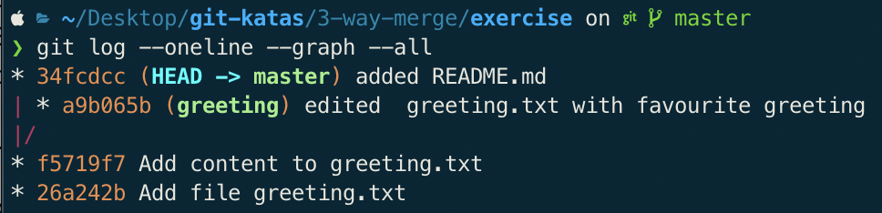
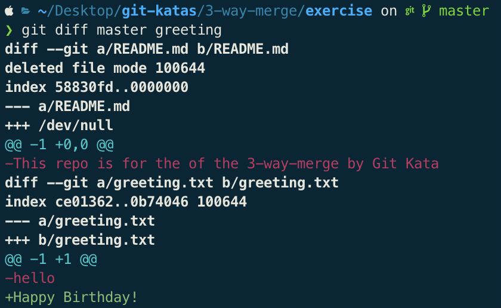
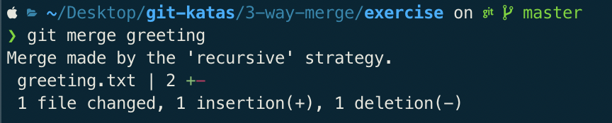

# Git Kata: 3-Way Merge

## The task
You again live in your own branch, this time we will be doing a bit of juggling with branches, to show how lightweight branches are in git.

1. Create a branch called greeting and check it out
```
$ git checkout -b greeting 
```

2. Edit the greeting.txt to contain your favorite greeting
```
$ echo "Happy Birthday\!" >greeting.txt
```

3. Add greeting.txt files to the staging area
```
$ git add greeting.txt
```

4. Commit
```
$ git commit -m "added greeting.txt with favourite greeting"
```

5. Switch back to the master branch
```
$ git checkout master
```

6. Create a file README.md with information about this repository
```
$ echo "This repo is for the of the 3-way-merge by Git Kata" >README.md
```

7. Add the README.md file to staging area and make the commit
```
$ git add README.md
$ git commit -m "added README.md"
```

8. What is the output of `git log --oneline --graph --all`?


9. Diff the branches


10. Merge the greeting branch into master

