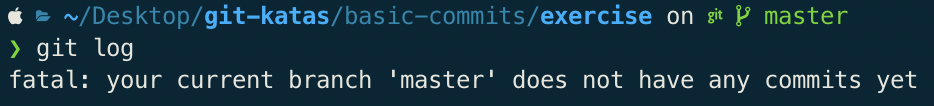

# Git Kata: Basic Commits

## The task

1. Use `git status` to see which branch you are on.


2. What does `git log` look like?


3. Create a file
` $ touch test.txt`

4. What does the output from `git status` look like now?


5. `add` the file to the staging area
` $ git add test.txt`

6. How does `git status` look now?


7. `commit` the file to the repository


8. How does `git status` look now?


9. Change the content of the file you created earlier
` $ echo "STUFF" >>test.txt `

10. What does `git status` look like now?


11. `add` the file change
` $ git add test.txt`

12. What does `git status` look like now?


13. Change the file again
` $ echo "more STUFF" >>test.txt`

14. Make a `commit`
` $ git commit -m "added more stuff to test.txt"`
15. What does the `status` look like now? The `log`?


16. Commit the newest change
``` 
$ git add test.txt
$ git commit -m "added more stuff to test.txt"
```
